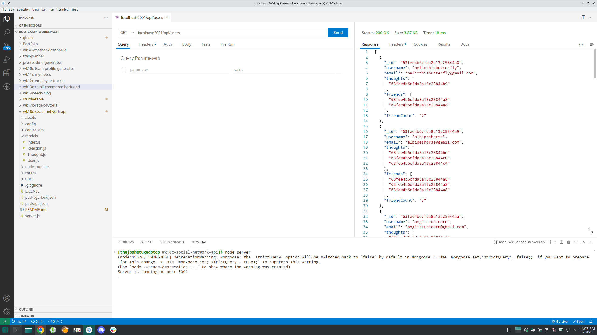

# wk18c-social-network-api

## Description

This is the backend of a social-network API. It uses mongoDB and mongoose to manage user data. It has functionality to view all, view one, update, and create users and thoughts. It also allows for the adding or removing friends and reactions. When a user is deleted, all associated thoughts are also deleted.

## Installation

The following installation steps below can be used to use the application.

- Install MySQL and NodeJS for your OS version
    - Configure MySQL
- Clone the repository to her local machine
- Open a terminal to the root of the cloned repo
- Run the following command in the terminal: $ npm i
- Run the following commands in the terminal:
    - $ npm run seed
    - $ node server

## Usage

In order to use the backend to view, add, and remove items, use the following paths:
- '/api/users'
- '/api/users/:userId'
- '/api/users/:userId/friends'
- '/api/users/:userId/friends/friendsId'
- '/api/thoughts'
- '/api/thoughts/:thoughtId'
- '/api/thoughts/:thoughtId/reactions/:reactionId'

Here is a video walkthrough: https://drive.google.com/file/d/17hqGQHsE5Yc_gU0E0cHnZwJrRz_yAOD6/view

## Credits

Used the following site to generate database seed data text content: https://loremipsum.io/
Seed data user name pool generated from the following website: https://jimpix.co.uk/words/random-username-generator.asp

## License

Refer to the LICENSE in the repo for the code. 
